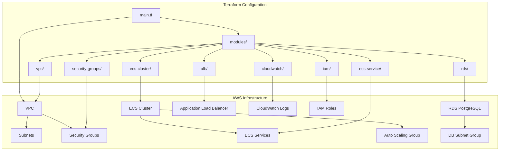
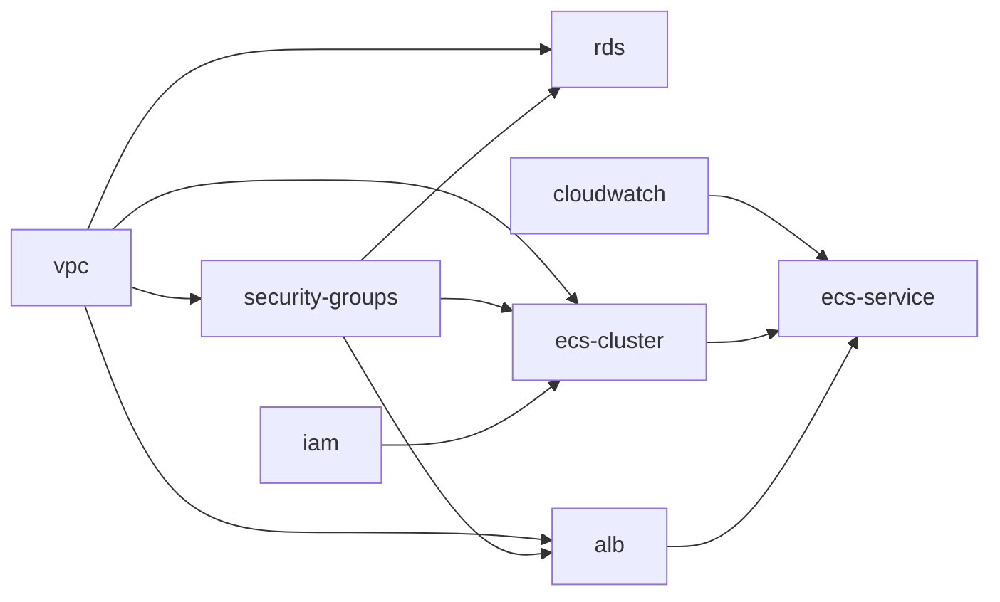

# Design Document

## Overview

Este documento descreve o design da solução para migração e gerenciamento da infraestrutura AWS usando Terraform. A solução implementa uma arquitetura modular que permite importar recursos existentes e gerenciá-los como código, mantendo a organização e reutilização de componentes.

## Architecture

### High-Level Architecture



### Module Dependencies



## Components and Interfaces

### Core Modules

#### 1. VPC Module (`modules/vpc/`)
- **Purpose**: Gerencia VPC existente e subnets
- **Resources**: 
  - `aws_vpc.main` - VPC principal (172.16.0.0/20)
  - `aws_subnet.public_*` - Subnets públicas em múltiplas AZs
- **Outputs**: `vpc_id`, `subnet_ids`
- **Protection**: Lifecycle prevent_destroy habilitado

#### 2. Security Groups Module (`modules/security-groups/`)
- **Purpose**: Define regras de segurança para todos os componentes
- **Resources**:
  - ECS security group (porta 80, 443, SSH)
  - RDS security group (porta 5432)
  - ALB security group (HTTP/HTTPS público)
- **Dependencies**: VPC module

#### 3. ECS Cluster Module (`modules/ecs-cluster/`)
- **Purpose**: Gerencia cluster ECS com Auto Scaling
- **Resources**:
  - `aws_ecs_cluster.main` - Cluster principal
  - `aws_launch_template.ecs` - Template para instâncias EC2
  - `aws_autoscaling_group.ecs` - Auto Scaling Group
  - `aws_ecs_capacity_provider.main` - Capacity Provider
- **Configuration**:
  - Instance type: t3.micro (free tier)
  - Min: 1, Max: 4, Desired: 1
  - ECS-optimized AMI

#### 4. ECS Service Module (`modules/ecs-service/`)
- **Purpose**: Define serviços e task definitions
- **Resources**:
  - `aws_ecs_task_definition` - Definição de tasks
  - `aws_ecs_service` - Serviço ECS
- **Configuration**:
  - Container image: ECR externo (não gerenciado)
  - CPU/Memory: Configurável via variáveis
  - Health checks e auto scaling

#### 5. RDS Module (`modules/rds/`)
- **Purpose**: Gerencia banco PostgreSQL
- **Resources**:
  - `aws_db_instance.bia` - Instância PostgreSQL 17.4
  - `aws_db_subnet_group.bia` - Subnet group
- **Configuration**:
  - Engine: PostgreSQL 17.4 (compatível com free tier)
  - Instance class: db.t3.micro
  - Storage: 20GB GP2
  - Backup retention: 7 dias

#### 6. ALB Module (`modules/alb/`)
- **Purpose**: Load balancer para distribuição de tráfego
- **Resources**:
  - `aws_lb` - Application Load Balancer
  - `aws_lb_target_group` - Target group para ECS
  - `aws_lb_listener` - Listeners HTTP/HTTPS

#### 7. IAM Module (`modules/iam/`)
- **Purpose**: Roles e policies necessárias
- **Resources**:
  - ECS task execution role
  - ECS instance profile
  - Policies para CloudWatch, ECR, etc.

#### 8. CloudWatch Module (`modules/cloudwatch/`)
- **Purpose**: Logs e monitoramento
- **Resources**:
  - Log groups para aplicação
  - Retention policies

## Data Models

### Variable Structure
```hcl
# Core Infrastructure
variable "aws_region" {
  description = "AWS region"
  type        = string
  default     = "us-east-1"
}

variable "vpc_id" {
  description = "Existing VPC ID"
  type        = string
}

variable "subnet_ids" {
  description = "List of existing subnet IDs"
  type        = list(string)
}

# ECS Configuration
variable "cluster_name" {
  description = "ECS cluster name"
  type        = string
  default     = "cluster-bia-ecs"
}

variable "service_name" {
  description = "ECS service name"
  type        = string
  default     = "bia-service"
}

# Container Configuration
variable "ecr_repository_url" {
  description = "ECR repository URL (external)"
  type        = string
}

variable "container_cpu" {
  description = "Container CPU units"
  type        = number
  default     = 256
}

variable "container_memory_reservation" {
  description = "Container memory reservation"
  type        = number
  default     = 512
}

# Database Configuration
variable "db_instance_class" {
  description = "RDS instance class"
  type        = string
  default     = "db.t3.micro"
}

variable "db_username" {
  description = "Database username"
  type        = string
  sensitive   = true
}

variable "db_password" {
  description = "Database password"
  type        = string
  sensitive   = true
}
```

### State Management
- **Backend**: Local state file (terraform.tfstate)
- **Import Strategy**: Script-based import para recursos existentes
- **State Protection**: Lifecycle rules para recursos críticos

## Error Handling

### Import Process
1. **Duplicate Resource Check**: Script verifica se recurso já existe no state
2. **Rollback Strategy**: Backup do state antes de importações
3. **Validation**: terraform validate após cada importação
4. **Conflict Resolution**: Ajuste de configurações para match com recursos existentes

### Resource Protection
```hcl
lifecycle {
  prevent_destroy = false
}
```
Aplicado em:
- VPC e Subnets
- ECS Cluster
- RDS Instance
- ECR Repository (referenciado como data source)

### Error Recovery
1. **State Corruption**: Backup automático do state
2. **Failed Apply**: Plan detalhado antes de apply
3. **Resource Drift**: terraform refresh para sincronização
4. **Module Errors**: Isolamento por módulo para debugging

## Testing Strategy

### Validation Levels

#### 1. Syntax Validation
```bash
terraform fmt -check
terraform validate
```

#### 2. Plan Validation
```bash
terraform plan -detailed-exitcode
```
- Exit code 0: No changes
- Exit code 1: Error
- Exit code 2: Changes planned

#### 3. Import Testing
```bash
# Test import script
./import-bia-resources.sh --dry-run
```

#### 4. Module Testing
- Individual module validation
- Dependency testing
- Output verification

### Integration Testing
1. **Full Stack Deploy**: Deploy em ambiente de teste
2. **Service Health**: Verificação de health checks
3. **Connectivity**: Testes de conectividade entre componentes
4. **Rollback**: Teste de rollback procedures

### Monitoring and Validation
- CloudWatch logs para aplicação
- ECS service health monitoring
- RDS connection testing
- ALB health check validation

## Security Considerations

### Network Security
- Security groups com least privilege
- Subnets públicas apenas para ALB
- RDS em subnets privadas (via subnet group)

### Access Control
- IAM roles com minimal permissions
- Task execution roles específicas
- Instance profiles para ECS instances

### Data Protection
- RDS encryption (configurável)
- Secrets management via AWS Systems Manager
- Environment variables seguras

## Deployment Strategy

### Phased Approach
1. **Phase 1**: Import recursos existentes
2. **Phase 2**: Validação e ajustes
3. **Phase 3**: Apply configurações
4. **Phase 4**: Monitoramento e otimização

### Rollback Plan
- State backup antes de mudanças
- Terraform plan review obrigatório
- Gradual rollout de mudanças
- Emergency rollback procedures